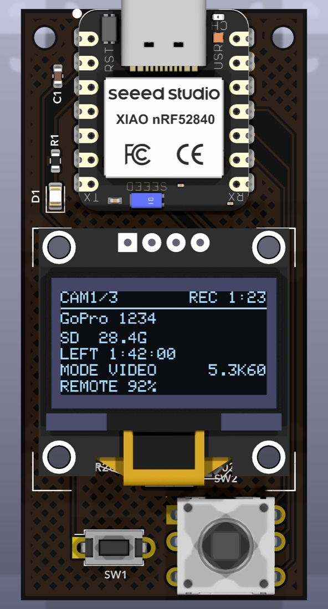

# Naked GoPro Remote

画面のない **剥きプロ（naked GoPro）** に BLE で繋ぎ、飛ばす前に確かめたいことを手元に出す小さなリモコン。

**製品ページ → https://cinewhooptokyo.github.io/naked-gopro-remote/**

*暫定の製品画像。有機ELに映っているのは実際の描画コードが出力した実ピクセル。*

## これは何か

剥きプロは画面も背面液晶も外してあるので、**録画が始まったのか／SD が入っているのか／動画モードなのか**が
飛ばす前に分からない。一本まるごと録れていなかった、という事故は帰ってきてから気づく。

このリモコンは Open GoPro の BLE API でカメラに繋ぎ、**剥きプロでは見えない情報だけ**を
0.96 インチの有機ELに出す。録画の開始・停止は独立したタクトスイッチで、手袋のまま押せる。

| | |
|---|---|
| 表示 | SD の有無と残量 / あと何秒録れるか / 動画モードか / 解像度・FPS / 過熱 / ペアリング状態 |
| 操作 | **REC 専用ボタン**（APEM MJTP1250）＋ 5方向スイッチ（カメラ選択・画面切替） |
| 同時接続 | **最大 8台**。1台ずつでも、全台まとめてでも（一覧は 2列 × 4行）|
| ペアリング | GoPro Labs の QR を**画面に表示**。基板裏にもシルクで刷ってある |

## 仕様

| | |
|---|---|
| MCU | Seeed XIAO nRF52840（技適 211-220207 / 内蔵アンテナ） |
| 表示 | 0.96" 128×64 有機EL（SSD1306 / I2C） |
| 電源 | **LIR2032 のみ**（充電式リチウムイオン）。USB-C で充電。**CR2032 は不可** |
| 基板 | 30.1 × 62.1mm / 2層 / 1oz / 黒レジスト・白シルク・ENIG |
| 対応 | GoPro HERO9 以降（Open GoPro BLE API） |

## ★ 状態：設計中・未検証

**これは設計データであって、製品ではない。**

- 基板は起こしたが**発注していない**（DRC 違反0・未接続0 までは通してある）
- ファームウェアは**コンパイルが通るだけ**で、実機で動かしていない
- 未確認：実機での BLE 動作 / 有機ELの取付穴ピッチ / 画面QRをカメラが読めるか

作って動かしたら、ここを書き換える。

---

CINEWHOOP TOKYO
